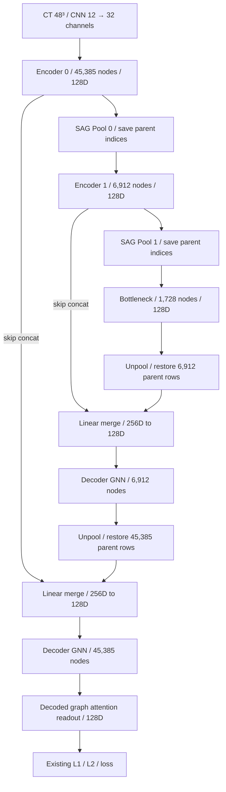

# L0 U-Net형 encoder–decoder 구현 및 실제 CT 검증

2026-09-23. 사용자는 단일 ‘문맥 학습 후 풀링’이 아닌 U-Net처럼 계층적으로 축소하고 복원하는 구조를 요구했다. 기존 late_sag는 이 요구의 구현이 아니므로 단일 풀링 비교군으로만 보존한다. 새 graph_unet 경로에 두 단계 pooling, bottleneck, 두 단계 unpooling, 대응하는 두 skip connection, decoder GNN을 연결했다.

## 실제 구조



도식의 노드 수는 이번 DEBUG 검증 프로필이며 최적 production 설정으로 확정하지 않았다. 기존 비교에서 명시했던 6,912/1,728을 두 단계의 검증 값으로 사용한다. 모델에는 pool_nodes를 필수로 전달하며 기본 축소율이나 OOM 축소 fallback이 없다.

기존 encoder GAT3층·hidden128·heads4를 보존하고 decoder GAT2층을 추가했다. encoder3단계는 두 하강 단계와 bottleneck에 대응하며 동일한 단계 수로 두 번 상승한다. 풀링마다 학습 GCN scorer 1개가 별도로 있다. 전체 모델1,949,659 trainable parameters, L0 1,117,273 parameters다. CNN, CT FOV/해상도, query/support 분리, 기존 L1/L2와 supervised_loss를 유지한다.

## pooling / unpooling / skip의 실제 역할

Pool은 각 단계의 특징과 공간 연결을 받아 SAGPooling(GCNConv)의 점수로 노드를 선택하고, 선택 특징에 학습 점수 gate를 곱한다. 다음 단계에서 사용한 노드는 현재 부모 단계의 ID로 저장한다. 2단계 ID는 첫 번째 축소 그래프 안에서의 ID이며 원본 ID와 혼동하지 않는다.

Unpool은 저장한 부모 ID 위치에 하위 특징을 scatter한다. 선택되지 않았던 위치에는 0이 들어간다. **이 연산만으로 버린 정보를 복구한다고 주장하지 않는다.** 같은 해상도의 encoder 특징 전체를 skip으로 concat하고 학습 Linear/LayerNorm/SiLU를 통해128D로 결합한다. 따라서 bottleneck에서 사라진 노드에도 해당 위치의 fine encoder 특징이 전달된다.

Decoder는 저장한 부모 단계의 adjacency를 복원해 GAT를 실행한다. 최종 출력은 원래45,385노드 공간으로 돌아온 뒤 graph readout을 거쳐 L1에 전달된다. 작은 bottleneck만 읽고 끝내거나 skip을 그림에만 표시한 구현이 아니다.

## 논문과의 관계 및 한계

[Graph U-Nets](https://arxiv.org/abs/1905.05178)의 계층적 pool/unpool, 저장한 선택 index와 skip 연결을 구조 근거로 사용했다. 설치 PyG2.6.1 `nn/models/graph_unet.py`의 down/pool/permutation 저장, zero-unpool, skip merge, up-conv 경로도 확인했다.

**현재 구현은 SAG/GAT 기반 U-Net형 변형이며 원 논문의 GCN/gPool/A² 전체 재현은 아니다.** 기존 CNN/GAT와 [SAGPool](https://arxiv.org/abs/1904.08082) 점수 방식을 유지한다. coarse adjacency는 선택 노드 사이 원래 공간 엣지를 보존하는 induced graph다. Graph U-Nets의 A² graph-power 연결 확장이나 soft cluster coarsening을 구현했다고 주장하지 않는다. 따라서 노드 수 축소만으로 물리적 연결 반경이 증가한다고 설명해서는 안 된다.

이 정책에서는 coarse graph가 여러 연결 성분으로 나뉠 수 있다. 실제 미학습 CT2위치에서 level1은8/6개 성분, level2는16/13개 성분이다. bottleneck 최대 성분 비율은0.777/0.720이다. 이 사실과 모든 선택 ID/adjacency를 저장했다. Decoder의 원래 topology 복원과 skip은 존재하지만, 그것이 coarse graph의 모든 정보 손실을 해결한다는 성능 근거는 아직 없다.

45,385개 후보가12³ CNN 특징의 보간 위치라는 이전 문제도 이 구조만으로 해결된 것이 아니다. 새 node source를 도입하거나 입력 해상도를 바꾸지 않았다. 이번 구현의 완료 범위는 사용자가 요구한 U자형 계산 경로와 실제 학습 연결이다.

## 코드와 실행

- `hiercp_v222/l0_graph_unet.py`: GraphUNetEncoder, batched induced_level, index unpool_nodes, full PromptGraphModel 결합.
- `hiercp_v222/l0_comparison.py`: comparison_model에서 명시적 mode=graph_unet을 선택할 수 있게 연결. 기존 비교군 유지.
- `config/l0_graph_unet_debug.json`: architecture와 검증 batch/데이터 프로필. 기존 production 설정을 덮어쓰지 않는다.
- `tools/verify_l0_graph_unet_debug.py`: 실제 CT SHA 검증, 병렬 읽기, inference/gradient/optimizer/계층 기록.
- `tests/test_l0_graph_unet_debug.py`: index 복원, gradient, 다단계 adjacency, 배치 독립성, 양쪽 skip 분기의 gradient, 불완전한 단일 pool 구성 거부.

```powershell
.\.venv\Scripts\python.exe tools/verify_l0_graph_unet_debug.py --output work/l0_graph_unet_debug_next
```

출력 디렉터리는 새 경로여야 한다. 디버그 학습으로 production checkpoint를 만들거나 r4 gate를 해제하지 않는다. 새 전체 코호트 학습/평가 실행기와 checkpoint 승격은 이번 작업의 완료 범위가 아니다.

## 실제 CT 검증 결과

결과: `work/l0_graph_unet_debug_20260923/`. 실제12개 고유 CT patch, 3 case; support는liver_1/liver_5의4patch, query는liver_108의8patch. 전체 inner-train11,279patch 중 명시적인 DEBUG 부분이며 전체 학습으로 간주하지 않는다. 정답과 마스크를 L0 입력에 넣지 않는다.

RTX5070Ti 16GB, CPU8 physical/16 logical, 시작 시 RAM 약49.5GB available. IO와CPU8threads, BF16 feature/GAT와 FP32 scorer. batch 단위 padded GAT 및 disjoint-union scorer를 사용하며 샘플별 순차 forward를 하지 않는다. 실행 타일은 모든 노드를 방문한다. CPU/CUDA tensor 왕복으로 그래프를 단계별 재구축하지 않는다.

| physical/effective batch | L0 중앙값 ms | graphs/s | peak allocated VRAM GiB |
|---:|---:|---:|---:|
| 2 | 138.21 | 14.47 | 1.814 |
| 4 | 235.10 | 17.01 | 2.079 |
| 8 | 449.44 | 17.80 | 2.612 |

warmup1회 후3회 중앙값. CNN→pool/encoder/bottleneck→unpool/skip/decoder→readout까지 포함한다. I/O/H2D, cold model/topology 초기화, 전체 support 갱신, CP/nnU-Net까지의 시간은 별도다. 이전 단일 late_sag212ms를 U-Net 속도로 재사용하지 않는다. 앞선 full_graph 약468ms와 이번449ms는 작은 DEBUG 시간 차이이며 학습 후 우열이나 유의한 개선으로 주장하지 않는다. batch8이 최적/최대 batch라는 뜻도 아니다.

전체 모델 실제 gradient smoke: query2개, optimizer1step, peak3.361GiB. encoder3개, pool2개, decoder2개, decoder update2개, skip merge2개, CNN, projection, readout, L1/L2, label seed의 실제 optimizer update 확인. 모든 trainable parameter에 유한 gradient 존재.

각 concat 입력에서 skip과 unpool 쪽 gradient L1 norm을 따로 확인했다: 첫 복원 단계0.2003/0.1748, 마지막 복원 단계1.7686/1.8061. 양쪽 모두0보다 크다. 따라서 decoder가 skip만 읽고 깊은 경로를 무시하거나 unpool branch를 끊어 놓은 구현이 아니다. 성능 측정 전에는 optimizer step을 하지 않았으며 시간 표는 초기 가중치다.

38테스트 통과: 새 U-Net4개, 이전 비교4개, leakage12개, PPR/실행10개, cluster8개. 정적 import/syntax도 검사 실행으로 확인했다. 합성 단위 테스트와 실제 CT smoke를 구분한다. 전체 학습·분할 평가·소형 종양 성능 검증은 미실행이다.

## 작업 완료 체크리스트

- [x] 서버 또는 원격 세션 종료 위험이 있는 명령을 사용하지 않았다.
- [x] 사용자 파일과 기존 결과를 파괴적으로 변경하지 않았다.
- [x] 모델 깊이와 너비를 편의상 축소하지 않았다. Encoder3층 보존, decoder2층 추가.
- [x] 그래프와 데이터 규모를 편의상 축소하지 않았다. Pool 수는 명시적 DEBUG 계약이며 최종 설정을 덮어쓰지 않았다.
- [x] 숨겨진 subset, cap, fast mode를 추가하지 않았다.
- [x] physical batch size와 병렬화 가능성을 실제로 검토했다. 2/4/8 측정.
- [x] GPU, CPU, RAM 활용 상태를 측정하거나 확인했다.
- [x] OOM이 없었으며 메모리 사전 admission과 실행 chunking을 사용했다.
- [x] 디버그 설정과 최종 설정을 분리했다.
- [x] dummy, placeholder, random fallback을 사용하지 않았다. 초기 가중치와 합성 단위 테스트는 명시했다.
- [x] 핵심 모듈이 forward, loss, gradient와 optimizer에 연결되어 있다.
- [x] 실제 실행 설정과 변경 사항을 명확하게 보고했다.
- [x] smoke test와 전체 학습 또는 전체 평가를 구분해서 보고했다.
