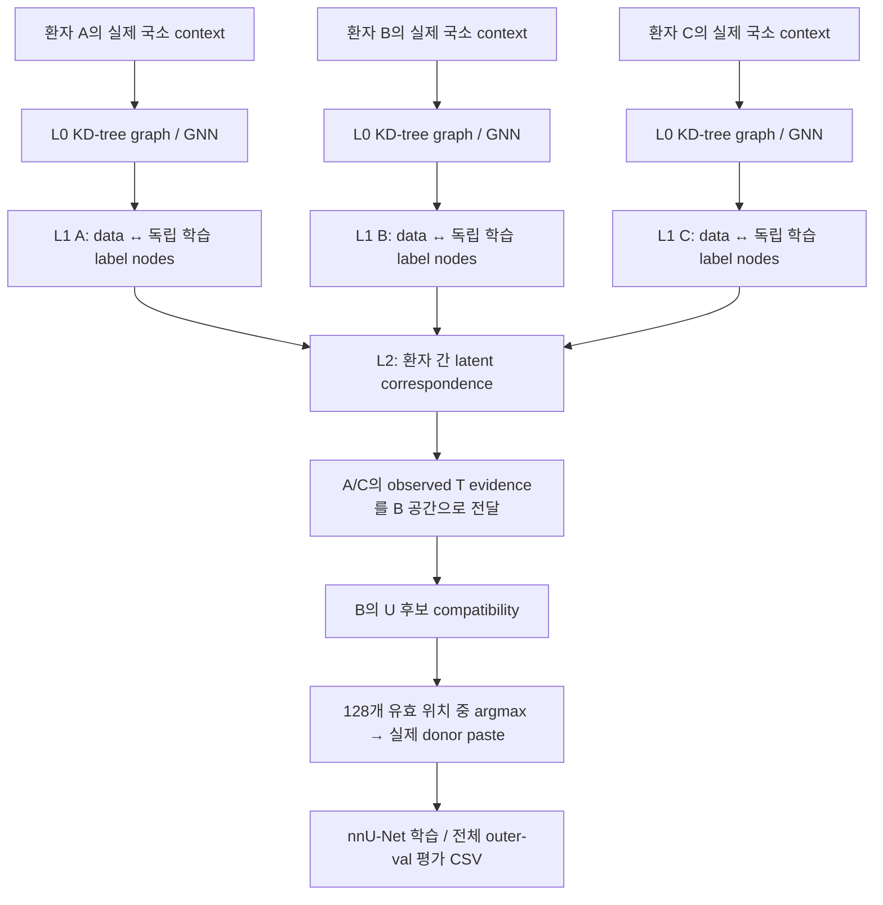

# 환자별 Prompt Graph 파이프라인 v2.1 — cross-patient r1

2026-09-19. 사용자 설명에 따라 L1/L2를 다시 구현한 현재 구조를 **v2.1**로 기록한다. 변경 이력은 [PATCH_NOTES.md](../PATCH_NOTES.md)를 따른다. 현재 artifact format은
`hiercp_prompt_graph_v2_cross_patient_r1`이다. **v2.0**은 동일 데이터의 두 stochastic view를
정렬하던 구현이다. 사용자 의도와 달라 폐기했으며,
`versions/v2/superseded_view_alignment_20260919/source.zip`에 보존했다.
원래 v1 및 과거 실험 결과도 보존한다.

`run_v2.py`, `hiercp_v2/`, `config/prompt_graph_v2.json` 등 경로명은 v2 계열 명칭으로 유지하며 현재 내용은 v2.1이다. 이번 버전 명칭 정리에서는 저장 format ID나 모델 코드를 변경하지 않았다.

**실제 의료 데이터 전체 학습·native nnU-Net 전체 연결 실행·성능 평가는 미실행이다.**
아래 구현의 연결성과 계약을 합성 DEBUG 입력으로 검증했으며 임상적 유효성을 입증한 것이 아니다.

2026-09-19 공통 donor 수정: Task03 Liver 전체 다운로드·131명 검증과 native 전처리는 완료했다. 잘못된 1,704,342개 graph 준비 실행은 중단·보존했다. 현재는 모든 outer-train 환자에게 같은 inner-train donor 풀을 적용하며, GNN의 균형 context round는 총 135,574개다. 실제 CP 요청마다 128개 위치를 모두 평가하고 argmax의 raw paste를 저장한다. 회귀 39개 통과. 누수 경계는 [공통 donor 계약](shared_donor_leakage_v21.md), 최신 실행·실패·실데이터 DEBUG 상태는 [로컬 실행 기록](local_v21_5070ti_run.md)을 따른다.

## 현재 구조



task는 실제 patient ID다. L0의 sampling augmentation은 남아 있지만 augmentation view를
서로 다른 환자/task라고 부르지 않는다. K-means와 두-view consistency objective는 제거했다.

### L0 및 실제 context

기존 full-scale L0 graph 생성·KD-tree 반경 연결·gated GATv2 인코더를 재사용한다.
source 전체 형상, 기존 sampling/반경 및 실패 시 오류 계약을 유지한다.
hidden 128, 4 heads, 3 layers, CNN 12/24/32, 5×48³ patch를 줄이지 않았다.

모든 실제 소형 tumor 원위치 T anchor를 보존한다. U context는 소형 종양 유무에 따른 분기 없이,
모든 inner-train donor와 모든 환자를 포함하는 균형 round로 배정하며 이벤트당 128개 후보를 만든다.
GNN 학습/검증 분할은 각각 독립적으로 배정하고 inner-val/outer-val은 donor 풀에 들어가지 않는다.
이는 native CP의 매 이벤트 donor 추출과 별개다. native CP는 모든 outer-train 환자가
동일한 전체 inner-train donor 풀에서 선택받는다. 이전의 source 없는 환자에게만 전체 donor를
붙이던 분기는 폐기했다. 상세 계약과 변경된 context 수는 [공통 donor·누수 방지](shared_donor_leakage_v21.md)를 따른다.

### L1: patient-specific random trainable labels

훈련 환자마다 별도의 K×128 parameter table을 두고 독립적으로 random initialize한다.
현재 K=16은 기존 capacity 예산을 유지한 구현 설정이며, 사용자가 지정한 절대 범주 수나
해부학 클래스가 아니다. 환자가 P명이면 환자별 label parameter는 P×16×128개다.
random initialization은 일반적인 학습 parameter 초기화이지 무작위 예측 fallback이 아니다.

공유 GNN 연산자가 각 환자의 data↔label message passing 2회를 수행한다. 환자별 state와
label parameters는 독립적이다. L1에는 다른 환자의 data가 직접 들어가지 않는다.
query는 label 메시지를 받기만 하며 support/label을 역으로 바꾸지 않는다.
data–label 연결 강도는 학습된 soft relation이고 label ID별 global class를 부여하지 않는다.

T/F/U는 data 관측의 의미이며, 특정 latent label 번호 자체를 tumor class로 정하지 않는다.

| 코드 | 의미 | 사용 |
|---|---|---|
| T=1 | 실제 관측된 적격 tumor의 원래 context | latent label에 positive evidence 집계 |
| F=0 | 명확한 기하학적 부적합 | 생산 후보 생성에서 차단; 모델 loss API는 명시적 F만 허용 |
| U=-1 | 유효한 위치지만 tumor positive가 미관측 | context 학습에 사용, negative supervision에서 제외 |

**정상 간이라는 이유로 F를 만들지 않는다.** 현재 생산 cache는 T와 U를 만들며,
불가능한 F 위치를 GNN 후보로 강제로 생성해 학습하지 않는다. F 차단은 기존 hard geometry
계약이다. U를 자동으로 T로 재기록하는 함수도 없다.

새/inner-val 환자는 별도의 deterministic random 초기 label과 학습된 공유 연산자로
context adaptation한다. 그 환자의 정답으로 parameter를 최적화하지 않는다.
이는 unseen patient의 label table을 직접 학습 완료했다는 뜻이 아니다.

### L2: cross-patient alignment와 sparse-positive transfer

모든 환자의 L1 label states에 2층 cross-attention을 적용한다. 같은 환자 내부 attention은
차단하고 서로 다른 환자의 label states 사이에서 정보를 교환한다.
정렬 state의 cosine/temperature row-softmax로 환자 a→b의 K×K correspondence를 만든다.

각 donor 환자의 **관측 T data–label relation만** 합하여 positive distribution을 만든다.
U는 negative 개수나 positive 분모로 쓰지 않는다. 환자별 관측 T 수로 정규화한 뒤,
correspondence를 통해 target 환자의 label 공간으로 전달하고 donor 환자별로 평균한다.
target 자신의 T는 항상 제외하고, inner-val 환자는 evidence donor가 될 수 없다.

B에 T가 하나도 없어도 A/C의 T가 있으면 B 공간에 positive support가 생긴다.
B query의 local posterior와 이 전달된 positive distribution의 cosine similarity가
placement compatibility score다. 이는 source와 candidate embedding의 단순 cosine이나
암 존재 확률이 아니다. 외부 T evidence가 전혀 없으면 available=false이고 생산 scorer는
점수를 지어내지 않고 오류를 낸다. 본훈련은 서로 다른 inner-train 환자 최소 2명에서 실제 T가 필요하다.

## 학습 objective와 해석 범위

다음 수학적 선택은 사용자 의도를 구현하기 위해 이번에 정한 **검증 전 연구 설계**다.

- 관측 transfer loss: T/F가 명시된 query의 compatibility 오차. U는 항과 분모에서 모두 제외된다.
- context reconstruction: local embedding과 label posterior 가중 label state에서 실제 입력의
  node feature 평균 및 CT patch 통계를 복원한다. U-only 환자도 이 loss와 정렬 loss로 학습한다.
- cross-patient alignment loss: 각 label에 soft assignment된 실제 context 통계의 유사성을
  soft correspondence teacher로 사용한다. target은 detach하며 같은 환자 pair는 제외한다.

세 loss 계수는 현재 1/1/1, temperature는 0.2다. 공유 support ID나 두 augmentation view
일치도를 정답으로 사용하지 않는다. **context 통계가 biological correspondence의 정답이라는
보장은 없다.** collapse/shortcut 가능성과 실제 placement 품질은 실제 데이터 실험에서 확인해야 한다.
T가 드문 상황에서 연결 경로가 존재한다는 합성 검증을 소형암 성능 개선으로 표현하지 않는다.

support의 L0 embedding은 epoch마다 전체 cohort에서 갱신하고 memory에 보관한다.
L1 label parameters와 L2는 각 optimizer step에서 학습하며 query의 L0에도 gradient가 전달된다.
첫 초기 embedding의 성능을 학습 결과처럼 내보내지 않는다.
마지막 가중치로 support를 재계산한 완료 checkpoint만 bank에서 허용한다.

## nnU-Net 및 평가

현재 selection은 `cross_patient_positive_transport_argmax`이며 frozen GNN의 점수로
128개 유효 후보를 평가한다. CP 확률 0.5, GNN 40 epoch, nnU-Net ResEncM/3d_fullres
250 epoch와 기존 raw-target transport를 유지한다. v1의 별도 feedback curriculum을
사용하지 않으므로 v1/v2.1 차이를 L2 하나의 ablation 효과로 해석할 수 없다.

compatibility가 높다는 이유로 원본 normal liver를 tumor GT로 바꾸지 않는다.
실제 donor CT/mask를 paste한 training sample에서만 pasted mask의 synthetic GT가 생긴다.
validation은 CP를 쓰지 않는다. 모든 outer-train 환자는 원래 소형 종양 유무와 무관하게 동일한 공통 donor CP 정책을 사용한다.

평가 CSV는 `case_metrics.csv`, `lesion_metrics.csv`, `summary.csv`,
`size_metrics.csv`다. 기존 v5 metric 함수/26-connectivity를 재사용하고 ≤10 /10–20 />20 mm별
검출 수, recall, lesion Dice와 기준별 TP/FP/FN을 기록한다.
Lesion Dice≥0.10 등은 크기 기준이 아닌 매칭 기준이다. 빈 분모는 unavailable로 기록한다.

## 실행과 호환성

`MEDICAL/Data/image/<case>_0000.nii.gz`, `MEDICAL/Data/labels/<case>.nii.gz`가 필요하다.
아래 WORK는 새 출력 경로이며 DATASET_ID는 사용 환경의 새 native ID다.

```text
python run_v2.py check
python run_v2.py import-split --outer-splits OUTER_SPLITS.json --inner-split INNER_SPLIT.json --outer-fold 0 --output WORK/split.json
python run_v2.py prepare --medical-root MEDICAL --split WORK/split.json --output WORK/gnn_cache
python run_v2.py train --cache WORK/gnn_cache/index.json --output WORK/gnn_train
python run_v2.py nnunet-plan --medical-root MEDICAL --split WORK/split.json --output WORK/native --dataset-id DATASET_ID
python run_v2.py bank --native WORK/native/native.json --checkpoint WORK/gnn_train/model.pt --output WORK/bank
python run_v2.py nnunet-train --native WORK/native/native.json --bank WORK/bank/index.json
python run_v2.py predict --native WORK/native/native.json --output WORK/inference
python run_v2.py evaluate --native WORK/native/native.json --predictions WORK/inference/predictions --output WORK/evaluation
```

v1 및 폐기된 view-only v2.0의 cache/checkpoint/bank는 v2.1 format과 호환되지 않는다.
기존 결과를 변환하거나 덮어쓰지 않고 새 경로를 사용한다. 자동 resume는 구현하지 않았다.
code.txt는 현재 소스 전달 파일이며 GitHub push/서버 배포 증거가 아니다.

## 자원과 검증 한계

**2026-09-19 로컬 GPU 실행 갱신:** RTX 5070 Ti / PyTorch 2.8.0+cu128 환경을 구축하고 L1 CUDA BF16 누적 dtype 오류를 수정했다. 현재 회귀는 26/26 통과이며 실제 GPU의 전체 폭 합성 forward/backward 1 step도 통과했다. 아래 CPU-only 설명은 최초 검증 당시 상태다. 실제 데이터 작업의 현재 단계와 로그는 [로컬 실행 기록](local_v21_5070ti_run.md)을 따른다.

L0는 disjoint-union batch, L1은 patient별 segmented aggregation, L2는 전체 label tensor로
처리한다. validation도 실제 환자들을 tensor로 함께 처리한다. query chunking은 전체 task context를
고정한 채 모든 query를 처리하며 patient/node/candidate를 자르는 cap이 아니다.

실제 graph/loss/backward로 physical batch 후보를 비교하고 worker 0/2/4/8의 전체 pass를 측정한다.
validation과 scoring도 전체 task memory를 포함해 별도 batch 측정을 한다.
현재 gradient accumulation=1이다. shared support가 증가하면 모델 규모를 몰래 줄이지 않고
메모리 오류와 전체 설정을 보고한다. 현재 단일 GPU 구현이며 DDP는 미구현이다.

nnU-Net은 기존 planner의 batch/patch를 보존한다. native batch/worker의 목표 GPU 처리량
측정은 아직 수행하지 않았다. 로컬 PyTorch는 CPU 빌드이고 nnunetv2가 없어 실제 native
end-to-end 실행은 검증하지 못했다. CPU/RAM/GPU 장치는 확인했으나 GPU 학습을 했다고 주장하지 않는다.

합성 검증은 independent label parameters, U loss gradient=0, T 없는 B로의 외부 evidence
전달과 점수 변화, 자기 환자 evidence 제외, query 역류 차단, label 순열, BF16 경로,
전체 폭 L0/L1/L2 gradient/optimizer update, 실제 타 환자 context의 GT 비변경을 확인한다.
환자 3명의 full-width DEBUG 모델은 7,086,156 parameters이며 환자 수에 따라 label table 크기가 늘어난다.
cohort/128개 후보 준비 loop 테스트는 geometry를 명시적으로 mock한 별도 정책 검사다.
그 검사를 실제 128개 의료 후보 geometry 검증으로 표현하지 않는다.

최종 관련 회귀 **25/25 통과, 실패/skip 0개**, Python 16개 정적 검사 통과.
로그와 현재 코드 해시는 `versions/v2/verification_cross_patient_final_20260919/`에 기록했다.

## 작업 완료 체크리스트

- [x] 서버 또는 원격 세션 종료 위험이 있는 명령을 사용하지 않았다.
- [x] 사용자 파일과 기존 결과를 파괴적으로 변경하지 않았다. 수정 전 v2도 보존했다.
- [x] 모델 깊이와 너비를 편의상 축소하지 않았다.
- [x] 그래프와 데이터 규모를 편의상 축소하지 않았다.
- [x] 숨겨진 subset, cap, fast mode를 추가하지 않았다.
- [x] physical batch size와 병렬화 가능성을 실제로 검토했다. 목표 GPU 실측은 미실행이다.
- [x] GPU, CPU, RAM 활용 상태를 측정하거나 확인했다. 로컬 검증은 CPU다.
- [x] OOM 대응은 memory/reference/batching 검토를 우선한다. 실제 GPU OOM 검증은 미실행이다.
- [x] 디버그 설정과 최종 설정을 분리했다.
- [x] 생산 코드에 dummy, placeholder, random fallback을 사용하지 않았다.
- [x] 핵심 모듈이 forward, loss, gradient와 optimizer에 연결되어 있다.
- [x] 실제 실행 설정과 변경 사항을 명확하게 보고했다.
- [x] smoke test와 전체 학습 또는 전체 평가를 구분해서 보고했다.
